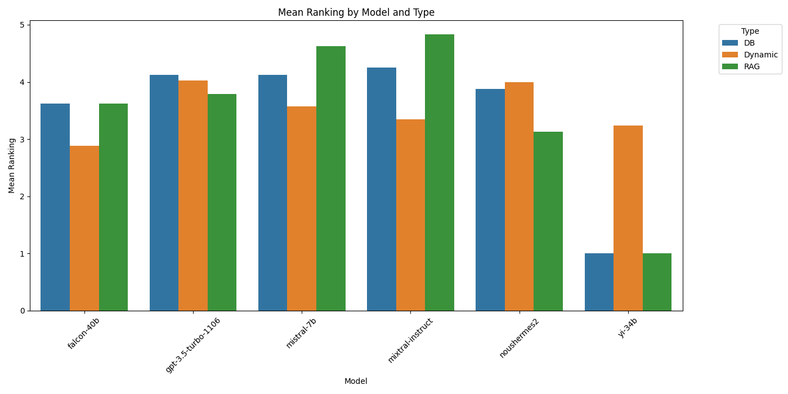

# galen-evals
A coworker for life sciences!

Most work we do in professional settings are task based. Sure, we hire people based on how well they did in abstract tests like GMAT, but what you want them to actually do are tasks. And tasks are what we need to test LLMs for. 

We learnt this the hard way, starting with dreams of training a cool model before figuring out what's actually needed! That's the purpose of this repo, to test LLMs against a set list of tasks and to evaluate them.

# What you need to run this
1. OpenAI API key
2. Groq API key (if you choose)
3. Add them to your .env file
4. Database files (we're currently BYOD until we open up ours)
5. Questions you want to ask

# Charts!

Yi-34b seems remarkably good, slightly lower latency but higher rankings. Think there's a cold start data problem though with Replicate.

Interesting: the performance from Yi is wow!

Mixtral is really slow with DB, and GPT stays winning in terms of speed. Yi's the same throughout it seems

GPT is the one that's solved cold start problem the best

# To do
There's plenty to do, but in no order:
1. Add a separate data analysis planner module
2. Create a code analyser with error correction loop, split out visualisation
3. Create a "working memory" for intermediate storage, and a "permanent memory" for continuous updating, eg of extracted info from documents
4. Fix table/ data updating from input PDFs
5. Enable LLMs to write reports on a given topic, and then run PageRank on it afterwards based on RAG over a question set on it (also in evals)
6. Create a "Best Answer" for the questions in case we want to measure the answers against that - (can also use this to DPO the models later as needed) (also for evals)
7. Create a code repository of clean written code over time for retrieval and usage
8. Add answer summarisation (as above)
9. Add RAG and ongoing index update
