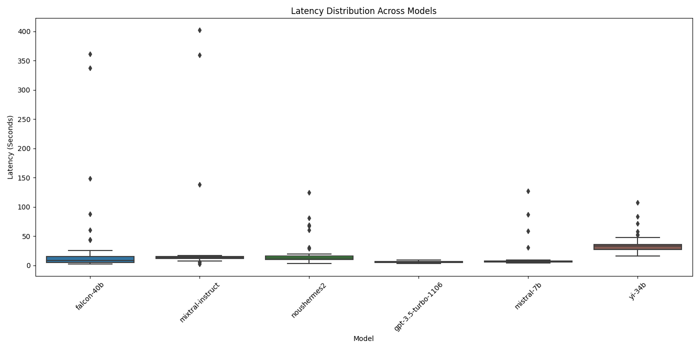

# galen-evals
A coworker for life sciences!

Most work we do in professional settings are task based. Sure, we hire people based on how well they did in abstract tests like GMAT, but what you want them to actually do are tasks. And tasks are what we need to test LLMs for. 

We learnt this the hard way, starting with dreams of training a cool model before figuring out what's actually needed! That's the purpose of this repo, to test LLMs against a set list of tasks and to evaluate them.

# What you need to run this
1. OpenAI API key
2. Replicate API key
3. Add them to your .env file
4. A list of questions that are relevant to your job

# Steps for evals
1. Update the configfile.json if needed. Oh and check the knowledgebase.json and perturbations.json inside utils to see if they have verisimilitude!
2. Run the perturbations file to get various OSS LLM responses, choose the ones you want in the code
3. Run response_gpt4 same to get GPT-4 responses
4. Do the same for DB and RAG files, having put the relevant parts in the folders
5. Combine the results files, then change the format to select combined file
5. Run eval_by_gpt4 to get GPT-4 to evaluate the answers
6. Run human eval if you can

# Charts!

Yi-34b seems remarkably good, slightly lower latency but higher rankings. Think there's a cold start data problem though with Replicate.

Interesting: the performance from Yi is wow!

Mixtral is really slow with DB, and GPT stays winning in terms of speed. Yi's the same throughout it seems

GPT is the one that's solved cold start problem the best

# Files
The crucial ones are:
1. questions.xlsx, which has the list of Questions we want to ask. This is the starting point, and what you should generate from your job!
2. "results grouped by question" which has the final list of answers from all LLMs
3. model_rankings.xlsx with the rankings for the final list of answers that were evaluated
4. All other files are intermediate creations, kept for auditing and any error checks

# To do
There's plenty to do, but in no order:
1. Create a test for tasks that combine the abilities together - search/ doc reading/ coding etc
2. Create tests against other hosting services (and more LLMs)
3. Speed up GPT execution by parallelising the API calls
4. Create "knowledgebase" and "perturbations" automatically from given information/ documents
5. Enable LLMs to write reports on a given topic, and then run PageRank on it afterwards based on RAG over a question set on it
6. Create a "Best Answer" for the questions in case we want to measure the answers against that - (can also use this to DPO the models later as needed)
7. Create a way to perturb the questions to see how well the LLMs react to new info coming in [Done]
8. Create a way to provide a "knowledgebase" to see how good the LLMs are at asking for help from the right quarters [Done]
9. Add answer clusters and plotting w.r.t categories to the automated model ranking file